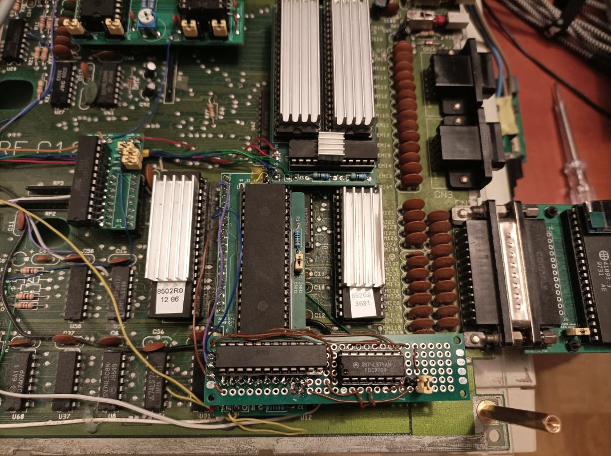
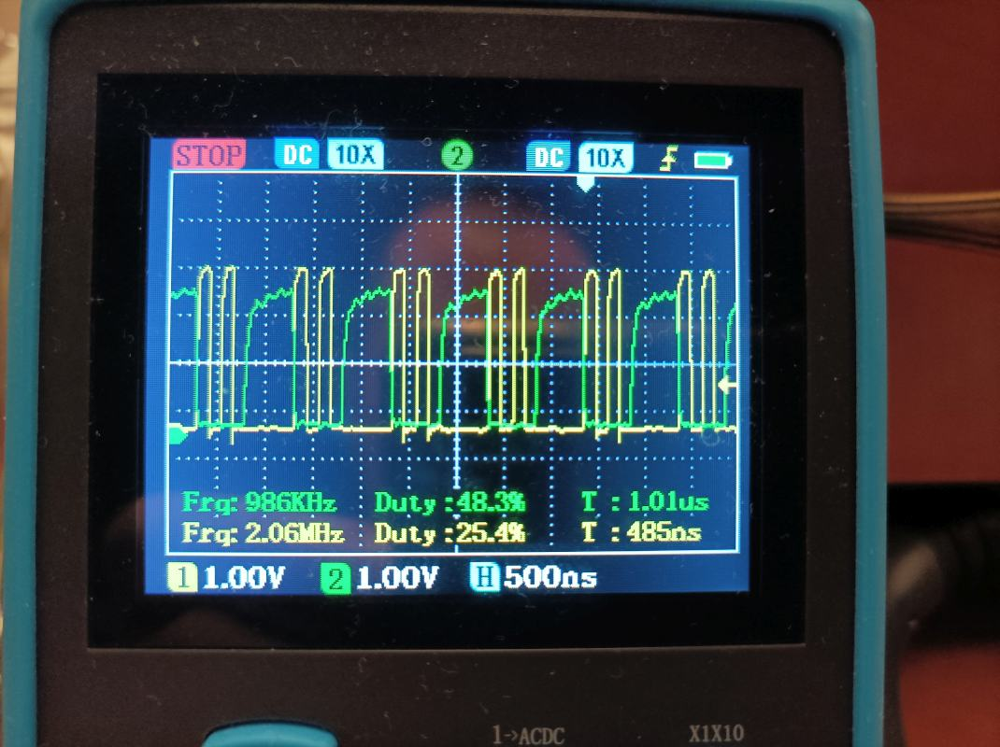
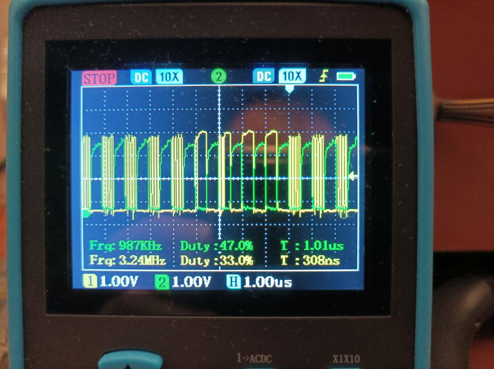

# C128 and 8MHz Z80

With a simple daughterboard, a GAL and a 74LS74 the Z80 in C128 can run at dot clock frequency (almost 8MHz) during its 1MHz phase of the system clock, effectively doubling the speed.

Basic benchmarks written in Turbo Pascal show that indeed it is about twice faster.

CP/M is visibly snappier, to the point of being usable.



This circuit works fine, during tests it was stable for several hours, busy with drawing fractals and calculating pi using Monte-Carlo method.

The CPU doesn't even get warm to the touch.

Disk I/O worked fine, as well as REU ram disk M: (emulated by UII+).

## BACKGROUND

There was a message sent to [cbm-hackers mailing list](https://www.softwolves.com/arkiv/cbm-hackers/7/7361.html) back in 2002, about a PCB for C128 that boosted Z80 to 8MHz

Unfortunately that device was not fully reverse-engineered and it seems that it was never mentioned again.

## PREPARING C128

I haven't tried to overclock the original Z80B, I replaced it some time ago by a Z84C0020 that uses much less energy.

Following modifications can be done using bending Z80 pins and soldering to the mainboard, but having a daughterboard will keep everything tidy.

We need to isolate `/WAIT` input (pin 24) from the mainboard because it is tied to `/NMI` there.
We will also disconnected from CPU the onboard `CLK` signal (pin 6).
We will use it as an GAL input to have an option of switching between the original clock (4MHz half of the time) and fast mode (8MHz half of the time).
The new `CLK` will be generated by GAL. We will also use few other lines from Z80 as GAL inputs.

We need two more inputs not available on the Z80 chip/Z80 socket. We want `DOT CLOCK` from the expansion port (pin 6) and the system clock 1MHz signal
(called `CLK1MHZ` below and `D1MHZ` on C128 schematic) from U12 (pin 11).

## OPERATION

This is the normal timing of Z80 in C128. During system clock `CLK1MHZ` low phase VIC generates two clock ticks for Z80.



We use `DOT CLOCK` instead to pass four ticks.



Whenever Z80 wants to read or write to/from memory or I/O we have to stop it until the start of the next 1MHz clock low phase.

Latched data from 74LS74 will hold the `/WAIT` line low until the end of current low phase of `CLK1MHZ` (Z80 turn).
During the following high phase (VIC's turn) 74LS74 will stay in reset and release `WAIT` to inactive (high) state, but during that time we will not output any clock pulses - just like in the original setup.

I had to add a case to `CLKOUT` to handle memory writes. Waitstate is not enough, the CPU had to be really stopped. That's not an issue for reads because they are buffered with U12.

## CIRCUIT

The Kicad project is in [z80-dotclock-gal-and-latch/](z80-dotclock-gal-and-latch) folder.

Schematic is also [available in PDF form](z80-dotclock-gal-and-latch/plots/z80-dot-gal.pdf).

## LOGIC EQUATIONS

PLD file to be used with WinCUPL to generate JED file for programming GAL is in the [z80-dotclock-gal-and-latch/gal/](z80-dotclock-gal-and-latch/gal/) folder.

I just happened to have an ATF22V10 available, but after renumbering the output pins the same file will work with 16V8. The circuit is also ready for that - just align pin 1 of 16V8 with pin 1 of the socket.


### CLKOUT
The simplest way to handle CLKOUT I did was:
```
  CLKOUT = !DOTCLK & !CLK1MHZ;
```
C128 started fine, but CP/M wouldn't boot. With pieces of Z80 code I was able to confirm that this works for I/O reads and writes but only memory reads.
Memory writes never happened, hence the special case with `MREQ & WR`. 

## 16MHZ?

I tried using the 16MHz clock signal from VDC (pin 2) instead of dot clock. That works... a bit.

The C128 will start, but CP/M won't boot. However all my simple tests passed.
I suspect that memory access is still an issue and some of the memory writes fail.
16MHz clock seems possible.

## OPEN QUESTIONS

1) How can we keep it simple but run at full speed all the time and stall only on memory and I/O access? It's not clear if the device mentioned in 2002 was really working at 8MHz all the time or just during Z80's turn.

2) Since I already used ATF22V10 which has asynchronous reset for registers, it should be possible to get rid of 74LS74 with different assignment of pin 1 (GAL CLK input). I wasn't able to do it.
   I'm probably doing something wrong - messing up high/low vs active/inactive or my CUPL skills are lacking (they are).

3) What is the problem with 16MHz clock? Maybe it should be created by doubling the dot clock to keep things in sync?
